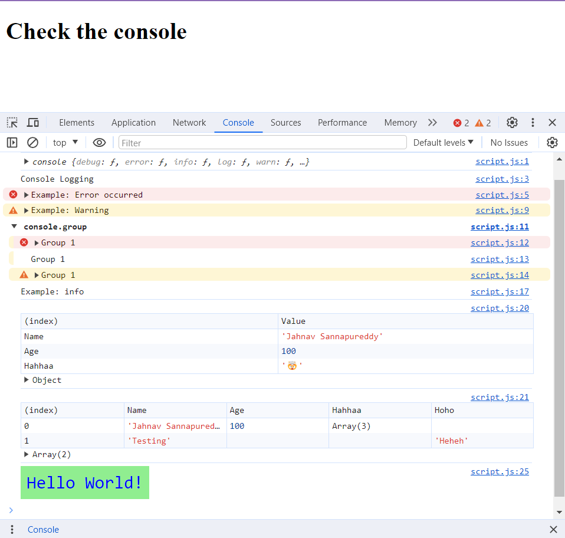

## OUTPUT



#### log

```js:
console.log(console);
console.log("Console Logging");
```

#### error 

```js:
console.error("Example: Error occurred");
```


#### warn

```js:
console.warn("Example: Warning");
```


#### info

```js:
console.info("Example: info")
```


#### group

```js:
console.group();
console.error("Group 1");
console.log("Group 1");
console.warn("Group 1");
console.groupEnd();
```


#### with css styles

```js:
const styles = "padding: 8px; color: blue; font####size: 24px; 
background####color: lightgreen;";
console.log("%cHello World!", styles);
```


#### table

```js:
console.table({"Name": "Jahnav Sannapureddy", "Age": 100, "Hahhaa": "🤯"});
```

